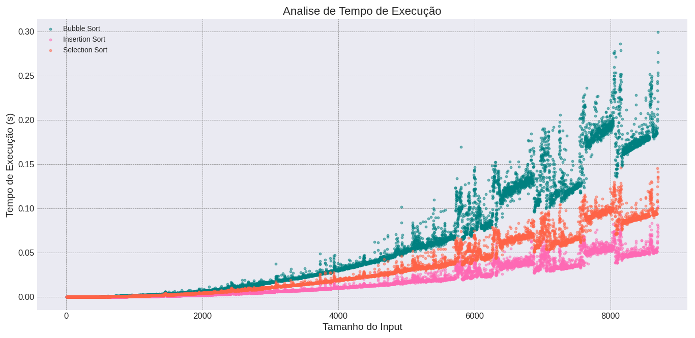

# Ordenação Simples

Esses arquivos esta a resolucao da Lista de Exercicios de Ordenacao Simples

A ideia é trabalhar com algoritmos de ordenação, como bubble sort, insertion sort e select sort.
Os exercicios a seguir tambem estao disponiveis
na [Lista](04_LISTA_DE_EXERCICIOS_-_ORDENACAO_SIMPLES-2.pdf)

## O exercicio 1
Comparação de Algoritmos 

    Implemente os algoritmos Bubble Sort, Insertion Sort e Selection Sort. Em seguida, crie um conjunto de dados (pode ser um array com números aleatórios) e use este mesmo 
    conjunto para ordenar com cada um dos algoritmos. Meça o tempo de execução de 
    cada algoritmo e compare seus desempenhos. Discuta em quais cenários cada algoritmo seria mais eficiente.

Nesse exercicio, eu desenvolvi um [codigo](ex1/ex1.c) em C que possui os tres metodos de ordenamento. Coloquei os três metodos para rodar em uma lista aleatoria que crescia cada vez mais e medi os tempos. Eu salvei esses dados no [arquivo .csv](ex1/Dados_ordenacao.csv).

Além disso criei um o [visualizar_ordenamento.py](visualizador_ordenacao.py) que ao rodar você consegue ter uma noção do resultado de cada metodo

*SPOILER*: O Bubble Sort ganhou

## O exercicio 2
Quick Sort com Pivôs Diferentes 

    Implemente o algoritmo Quick Sort. Experimente com diferentes métodos de escolha 
    de pivô (por exemplo, sempre o primeiro elemento, o elemento central, ou um 
    elemento aleatório) e veja como a escolha do pivô afeta o desempenho do algoritmo 
    em diferentes conjuntos de dados.

Nesse exercicio, eu desenvolvi um [codigo](ex2/ex2.c) em C que possui os tres pivôs diferentes(ultimo, aleatorio e primeiro) no QuickSort. Coloquei os três tipos de pivos para rodar em uma lista aleatoria que crescia cada vez mais e medi os tempos. Eu salvei esses dados no [arquivo .csv](ex2/Dados_quickSort.csv).

Além disso criei o [visualizar_quickSort.py](visualizador_quickSort.py) que ao rodar você consegue ter uma noção de qual pivô tem um resultado melhor

*SPOILER*: O Pivô que começa no final é melhor

As aulas foram ministradas pelo professor Francisco e pela professora Telma Soares,
no Instituto de Informatica da UFG.